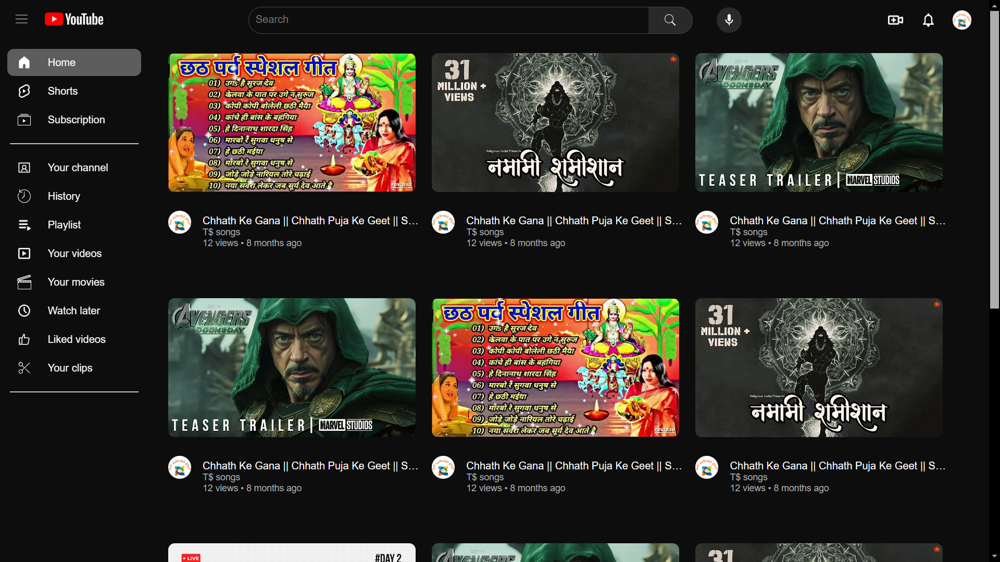

# YouTube Clone Webpage

Welcome to the **YouTube Clone Webpage**! This project is a web application that mimics the basic functionality and design of YouTube. It showcases how to build a video-sharing platform with modern web technologies.

## 📜 **Description**

The YouTube Clone Webpage is designed to replicate the core features of YouTube. Users can view videos, navigate through a video list, and experience a user interface similar to the original platform. This clone is built using HTML, CSS, and JavaScript, and demonstrates key web development concepts.

## ✨ **Features**

- **Video Display**: View and play videos in a user-friendly interface.
- **Video List**: Browse through a list of videos with titles and thumbnails.
- **Responsive Design**: Optimized for both desktop and mobile devices.
- **Basic Navigation**: Navigate through different video categories and selections.

## 🔗 **Live Demo**

Explore the live demo of the YouTube Clone Webpage [here](https://ravigitacc87.github.io/YT-Clone/).

## 📸 **Preview**



## 🚀 **Getting Started**

To run this project locally, follow these steps:

1. **Clone the repository:**
    ```bash
    git clone https://github.com/Ravigitacc87/youtube-clone.git
    ```

2. **Navigate to the project directory:**
    ```bash
    cd youtube-clone
    ```

3. **Open `index.html` in your web browser:**
    ```bash
    open index.html
    ```

## 🛠️ **Technologies Used**

- **HTML**: Structure of the webpage.
- **CSS**: Styling and layout for a responsive design.
- **JavaScript**: Interactive features and functionality.

## 📂 **Project Structure**

```
youtube-clone/
│
├── css/                # Folder for CSS styles
│   └── styles.css      # Main stylesheet
├── js/                 # Folder for JavaScript files
│   └── script.js       # Main script file
├── videos/             # Folder for video files and thumbnails
│   └── example.mp4     # Sample video
│   └── thumbnail.jpg   # Sample thumbnail
├── index.html          # Main HTML file
└── README.md           # Project description and details
```

## 🔧 **Usage**

- **Video Playback**: Click on a video thumbnail to view and play the video.
- **Navigation**: Use the navigation elements to switch between different video categories or sections.

## 🤝 **Contributing**

Contributions are welcome! If you have suggestions or improvements, fork the repository, make your changes, and submit a pull request.

---

Enjoy exploring and using the YouTube Clone Webpage! If you have any questions or feedback, feel free to reach out.

---
